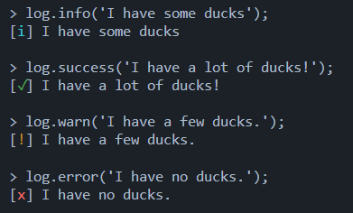
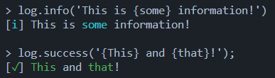
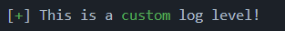
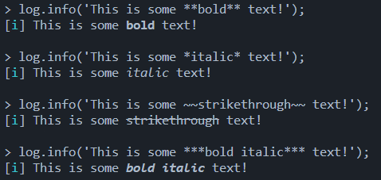

# @kogs/logger
 [](LICENSE)

`@kogs/logger` is a [Node.js](https://nodejs.org/) package that provides a logging interface.

- Provides elegant colour formatting.
- [printf](https://en.wikipedia.org/wiki/Printf_format_string)-style string formatting.
- Supports basic [Markdown](https://en.wikipedia.org/wiki/Markdown) formatting.
- Progress bars, user input, and other interactive features.
- Full [TypeScript](https://www.typescriptlang.org/) definitions.
- Only one tiny dependency ([picocolors](https://github.com/alexeyraspopov/picocolors)).

## Installation
```bash
npm install @kogs/logger
```

## Usage
```js
import log from '@kogs/logger';
log.info('This is {some} information!');
```

## Documentation

- [Default Log Levels](#default-log-levels) - The default log levels provided by the logger.
- [Plain Text Logging](#plain-text-logging) - Logging messages without a prefix/formatting.
- [Custom Log Levels](#custom-log-levels) - Adding custom log levels.
- [String Formatting](#string-formatting) - printf-style string formatting.
- [Decorating Messages](#decorating-messages) - Decorating messages, such as adding colours.
- [Markdown Formatting](#markdown-formatting) - Formatting messages using Markdown.
- [Indentation](#indentation) - Indenting messages; useful for nested messages.
- [Pause/Resume Logging](#pauseresume-logging) - Pausing/resuming logging.
- [Progress Bar](#progress-bar) - Display dynamic progress bars.
- [User Input](#user-input) - Prompting the user for input.
- [User Choice](#user-choice) - Prompting the user to choose from a list of options.
- [Stream Piping](#stream-piping) - Piping the logger to a custom stream.
- [Custom Loggers](#custom-loggers) - Creating custom logging instances.
- [Line Termination](#line-termination) - It's the end of the line; literally.
- [Blank Line](#blank-line) - Adding a blank line to the output.

### Default Log Levels

By default, `@kogs/logger` has 4 log levels: `info`, `success`, `warn`, and `error`, each with a corresponding color and symbol.



### Plain Text Logging

It may be preferable to log messages without a prefix/formatting, which can be be done using the `log.write(message, ...args)` method.

> **Note:** For the purposes of custom streams, `log.write(message, ...args)` is considered part of the `info` log level.

```js
log.write('Hello, world!');
// > Hello, world!
```

### Custom Log Levels

To add a custom logging level, use the `log.level(name, decorator)` method. The first argument is the name of the level and must be a valid JavaScript identifier.

The second argument is an optional decorator function: `fn: (msg: string) => string`. This is useful for adding colors or prefixes to the logged messages.

```js
log.level('debug', msg => `DEBUG: ${msg}`);
log.debug('This is a debug message');

// > DEBUG: This is a debug message
```
The builtin log levels can be overridden by adding a custom log level with the same name, however you cannot use names of other functions on the `Log` class.
```js
// Overwriting log levels is fine:
log.level('info', (msg) => `INFO: ${msg}`);

// But this will throw an error:
log.level('level', (msg) => `INFO: ${msg}`);
```
The standard log levels have decorators that add colors and prefixes. See the [Decorating Messages](#decorating-messages) section for how to use these.

### String Formatting

All logging methods support [printf](https://en.wikipedia.org/wiki/Printf_format_string)-style string formatting using the [util.format()](https://nodejs.org/api/util.html#utilformatformat-args). See the [documentation](https://nodejs.org/api/util.html#utilformatformat-args) for more information.

```js
log.info('This is a %s', 'formatted string');
// > [i] This is a formatted string
```

Arguments provided to the logging methods for string formatting are **not** subject to colour or Markdown formatting.

```js
log.info('My message is %s bold!', '**not**');
// > [i] My message is **not** bold!
```

### Decorating Messages

The built-in log levels have decorators that add colour to any text that appears between curly braces, `{` and `}`.



The function `formatBraces` is exported from the package for use in your own custom log levels. For colouring, the library [picocolors](https://github.com/alexeyraspopov/picocolors) is used internally.

```js
import { log, formatBraces } from '@kogs/logger';
import pc from 'picocolors';

log.level('add', m => formatBraces('[{+}] ' + m, pc.green));
log.add('This is a {custom} log level!');
```


### Markdown Formatting

A basic level of the [Markdown](https://en.wikipedia.org/wiki/Markdown) formatting syntax is supported by the logger, including `bold`, `italic` and `strikethrough` text.



If you want to disable Markdown formatting, you can do so by setting the property `enableMarkdown` on the logger to `false`.

```js
log.enableMarkdown = false;

log.info('This is a *bold* message');
// > [i] This is a *bold* message
```

For no particular reason, the function `formatMarkdown` which handles the Markdown formatting is exported from the package.

### Indentation

The `log.indent(x)` and `log.outdent(x)` methods can be used to indent and unindent the logger's output. Both of the functions return the logger instance, allowing for chaining.

```js
log.info('This is an info message');
// > [i] This is an info message

log.indent().info('This is an indented info message');
// > [i] This is an indented info message

log.outdent().info('This is an info message again');
// > [i] This is an info message again
```

By default, indentation is done using 2 spaces. You can change this by setting the `indentString` property on the logger.

```js
log.indentString = '\t';
log.indent().info('This is an indented info message');
// > [i] 	This is an indented info message
```

Additionally, you can provide a number to `log.indent(x)` and `log.outdent(x)` to specify the number of indentations to add/remove.

```js
log.indent(4).info('This is an indented info message');
// > [i]             This is an indented info message

log.outdent(2).info('This is an info message again');
// > [i]     This is an info message again
```

The convinience method `log.clearIndentation()` can be used to reset the indentation level to 0.

```js
log.indent(4).info('This is an indented info message');
// > [i]         This is an indented info message

log.clearIndentation();
log.info('This is an info message again');
// > [i] This is an info message again
```

### Pause/Resume Logging

The `log.pause()` and `log.resume()` methods can be used to temporarily disable logging.

Any messages logged while logging is paused will be discarded and **not** retroactively logged when `log.resume()` is called.

```js
log.pause();
log.info('This message will not be logged');

log.resume();
log.info('This message will be logged');
// > [i] This message will be logged
```

### Progress Bar

The `log.progress(message)` method allows you to display a dynamic progress bar in the terminal. The function is non-blocking and returns a progress bar object.

> **Note:** Values provided to `progress.update(value)` are clamped between 0-1, meaning any value lower than 0 will be treated as 0, and any value higher than 1 will be treated as 1.

```js
const progress = log.progress('Downloading > ');
const file = fs.createWriteStream('file.zip');

https.get(someZipURL, (response) => {
	// The content-length header being available depends
	// on the server, but we'll use it for this example.
	const total = parseInt(response.headers['content-length'], 10);

	let downloaded = 0;
	response.on('data', (chunk) => {
		file.write(chunk);
		downloaded += chunk.length;

		// Update the progress bar with a value between 0-1.
		progress.update(downloaded / total);
	});

	response.on('end', () => {
		file.end();
	});
});

// Downloading > [============                            ] 30%
// Downloading > [========================                ] 60%
// Downloading > [========================================] 100%
```
> **Note:** The progress bar is always and only written to `process.stdout`, regardless of how the logger is configured.
>
> Additionally, messages sent through the logger while a progress bar is active will appear above the progress bar, and the progress bar will be reprinted after the message is logged.

Once `progress.update(value)` has been provided with a value of 1, the progress bar will automatically finish and turn green. To finish prematurely, you can call `progress.finish()`, which will skip to 100% and turn the progress bar green.

In the event that you want to indicate failure, you can call `progress.cancel()` instead. This will leave the progress bar at its current value and turn it red.

```js
response.on('error', e => {
	progress.cancel();
	log.error('Failed to download file: %s', e.message);
});

// Downloading > [============                            ] 30%
// > [!] Failed to download file: [error message]
```

### User Input

The `log.prompt(message)` method allows you to prompt the terminal user for input.

```js
const name = await log.prompt('What is your name? ');
log.info('Hello, %s!', name);

// > What is your name? [user input]
// > [i] Hello, [user input]!
```
> **Note:** The prompt is always and only written to `process.stdout`, regardless of how the logger is configured.

If the prompt message is not provided, it will default to `> `.

```js
const name = await log.prompt();
// > [user input]
```

While `log.prompt(message)` is waiting for user input, normal logging functions can still be used freely. Messages logged while a prompt is active will appear above the prompt, and the prompt will be reprinted after the message is logged.

```js
log.info('This is the first message sent.');
log.prompt('What is your name? ').then(name => {
	log.info('Hello, %s!', name);
});
log.info('This is the second message sent.');

// > [i] This is the first message sent.
// > [i] This is the second message sent.
// > What is your name? [user input]
// > [i] Hello, [user input]!
```
If you want to ensure that nothing is logged while the user is being prompted, you can use the `log.pause()` and `log.resume()` methods.

> **Note:** Keep in mind that all messages logged while the logger is paused will be discarded.

In some scenarios, the user may be entering sensitive information. In these cases, the second parameter of `log.prompt(message)` can be set to `true` to mask the user's input.

> **Note:** Keep in mind that this only masks the input in the terminal, the actual value is still uncensored.
```js
const pass = await log.prompt('Password > ', true);
log.info('Your password is %s', pass);

// > Password > ******
// > [i] Your password is potato
```

### User Choice

When writing a CLI application, you may want to prompt the user to choose from a list of options. The `log.choice(...choices)` method allows you to do this.

```js
log.info('What is your favorite color?');
const choice = await log.choice('Blue', 'Red');
log.success('You chose %s!', choice);

// > [i] What is your favorite color?
// >   (b) Blue  (r) Red  
// > [✓] You chose Blue!
```

A few things here are happening by default here which we can customize. The first is that we are automatically assigning a key to each choice. This is done by taking the first letter of the choice and using it as the key.

To customize the keys, pass an array of objects instead of strings. Each object must have a `label` property, and can optionally have a `key` property.

```js
const choice = await log.choice([
	{ label: 'Continue', key: 'C' },
	{ label: 'Cancel', key: 'X' }
]);

// >   (C) Continue  (X) Cancel  
```

You're not restricted to just letters. For example if you wanted to use `Enter` and `Escape`, you could use the escape codes `\r` and `\x1B` respectively.

Something to keep in mind is using escape codes like this will result in weird labels. To fix this, set `prependKey` to `false` in the options (the second argument to `log.choice`) and include the keys as part of your labels - this also allows you to customize them!

```js
import pc from 'picocolors';
const choice = await log.choice([
	{ label: `(${pc.green('Enter')}) Continue`, key: '\r' },
	{ label: `(${pc.red('Esc')}) Cancel`, key: '\x1B' }
], { prependKey: false });

// >   (Enter) Continue  (Esc) Cancel    
```

The return value from `log.choice(...choices)` is the label of the choice that was selected. To change what is returned, you can set the `value` property on the choice object; this can be a `string`, `number` or `boolean`.

```js
const choice = await log.choice([
	{ label: 'Continue', value: 'opt-continue' },
	{ label: 'Cancel', value: 'opt-cancel' }
]);

// >  (c) Continue  (2) Cancel

if (choice === 'opt-continue') {
	// ...
} else if (choice === 'opt-cancel') {
	// ...
}
```
In the above example, the `Cancel` choice is assigned the key `2` because the first letter of `Cancel` is `C`, which is already taken by the `Continue` choice.

By default, the margin (space either side of the choices) is 2. This can be customized by setting the `margin` property in the options object.

```js
const choice = await log.choice([
	{ label: 'Continue', key: 'C' },
	{ label: 'Cancel', key: 'X' }
], { margin: 4 });

// >    (C) Continue    (X) Cancel    
```

### Stream Piping

By default, the logger writes messages of the `info` and `success` level to `process.stdout` and messages of the `warn` and `error` level to `process.stderr`.

To add an additional stream to the logger, use the `log.pipe(stream, levels)` method. This takes a [`WritableStream`](https://nodejs.org/api/stream.html#stream_class_stream_writable) and an array of log levels to pipe.

```js
const stream = fs.createWriteStream('log.txt');
log.pipe(stream, ['info', 'success']);
```

If the `levels` argument is omitted or empty, all log levels will be piped to the stream. Additionally, passing a string as the first argument will treat it as a file path and create a write stream for you.

```js
log.pipe('log.txt'); // Pipe all log levels to log.txt
```
A stream can be removed from the logger by calling `log.unpipe(stream)`. Streams will be **automatically** removed if they are closed.

```js
const stream = fs.createWriteStream('log.txt');
log.pipe(stream, ['info', 'success']);

// Remove and keep open.
log.unpipe(stream); // Remove stream manually but still open.
stream.write('This will not be logged');

// End stream and remove automatically.
stream.end(cb => {
	// Stream is now automatically removed from the logger.
});
```

In addition to adding/removing streams, you can also adjust the levels of existing streams with the `log.pipe(stream, levels)` method.

> **Note:** The provided levels are not additive, they replace the existing levels for the stream, so be sure to include all the levels you want to pipe.

```js
// Add `warn` level to process.stdout.
log.pipe(process.stdout, ['info', 'success', 'warn']);

// Remove `warn` from process.stderr to prevent duplication.
log.pipe(process.stderr, ['error']);
```

### Custom Loggers

By default, the `log` object is a singleton instance of the `Log` class. You can create your own instances of the `Log` class by importing it.

```js
import { Log, log } from '@kogs/logger';

// `log` is the default instance of the `Log` class
// `Log` is the class itself, which can be instantiated.

const customLog = new Log();
customLog.info('This is a custom log instance');

// > [i] This is a custom log instance
```

Any changes made to the global `log` instance will not be reflected in custom log instances and vice versa. Unless you need to create multiple loggers, it is recommended to use the global `log` instance for convenience.

### Line Termination

By default, output lines are terminated with the `\n` character. To change this, you can set the `lineTerminator` property.

```js
log.lineTerminator = '\r\n';
log.info('This is an info message');

// > [i] This is an info message\r\n
```

### Blank Line

There probably didn't need to be an entire section dedicated to this, but now you're here, the `log.blank()` function adds a blank line.

> **Note:** The blank line is written to the `info` level.

```js
log.info('Hello from above!');
log.blank();
log.info('Hello from below!');

// > [i] Hello from above!
// >
// > [i] Hello from below!
```

## What is `@kogs`?
`@kogs` is a collection of packages that I've written to consolidate the code I often reuse across my projects with the following goals in mind:

- Consistent API.
- Minimal dependencies.
- Full TypeScript definitions.
- Avoid feature creep.
- ES6+ syntax.

All of the packages in the `@kogs` collection can be found [on npm under the `@kogs` scope.](https://www.npmjs.com/settings/kogs/packages)

## Contributing / Feedback / Issues
Feedback, bug reports and contributions are welcome. Please use the [GitHub issue tracker](https://github.com/Kruithne/kogs-utils/issues) and follow the guidelines found in the [CONTRIBUTING](CONTRIBUTING.md) file.

## License
The code in this repository is licensed under the ISC license. See the [LICENSE](LICENSE) file for more information.